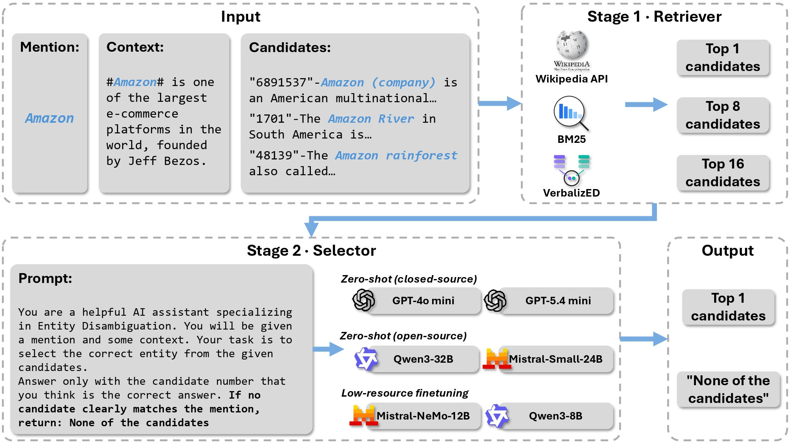

# RAISED: Retrieval And Inference-based Selection for Entity Disambiguation

This repository contains the official code for the paper:  
**"Select, Don't Train: The Benefits of Modular Entity Disambiguation with LLM-Based Selection"** *Submitted to ISWC 2026 (Research Track)*

## 📌 Overview

<p align="center">
  
</p>

**RAISED** (Retrieval And Inference-based Selection for Entity Disambiguation) is a modular framework that decouples the two core subproblems of Entity Disambiguation (ED):
1. **Candidate Retrieval**: Sourcing potential entities from a Knowledge Base (KB).
2. **Contextual Selection**: Identifying the correct entity from the retrieved set.

Our research demonstrates that once selection is delegated to a capable Large Language Model (LLM), the need for specialized, training-intensive retrievers diminishes. A fully training-free **BM25 + LLM** pipeline achieves a new state-of-the-art on the ZELDA benchmark.

### Key Contributions
- **Modular Pipeline**: Decoupled retrieval and selection stages.
- **State-of-the-Art Performance**: A training-free BM25 + LLM pipeline outperforms traditional dual-encoder models.
- **Systematic Comparison**: Evaluations of BM25 (Sparse), Wikipedia API (Web Search), and VERBALIZED (Dense) retrievers.
- **Abstention Mechanism**: The first LLM-based ED framework that allows for explicit "None of the Candidates" (NoC) predictions to handle retrieval failures.
- **Broad Model Support**: Support for GPT-4.5/5.4 mini (Closed), Qwen2.5/32B, and Mistral-Small (Open-source).
- **Data Efficiency**: Demonstrates that lightweight fine-tuning (QLoRA) with as few as 1,000 examples can make smaller open-source models competitive.

---

## 📊 Performance at a Glance (ZELDA Benchmark)

| Retriever | Selector | In-KB Micro-F1 | Abstention-Aware F1 |
| :--- | :--- | :---: | :---: |
| Dual-Encoder (Baseline) | N/A | 82.3 | - |
| **BM25** (Training-free) | GPT-5.4-mini | **86.3** (+4.0) | **90.7** |
| **VERBALIZED** (Dense) | GPT-5.4-mini | **88.5** (+6.2) | **91.2** |

---

## 📂 Repository Structure

```text
RAISED/
├── data/               # Instructions to download ZELDA datasets and VERBALIZED checkpoints and verbalizations
├── retrieval/          # Stage 1: Candidate Generation
│   ├── bm25/           # BM25 over ZELDA entity dictionary
│   ├──verbalized/     # repurposed VERBALIZED dual-encoder
│   └── wikipedia_api/  # Wikipedia Search API integration
├── selector/          # Stage 2: LLM-Based Selection
│   ├── finetuning/        # QLoRA scripts (Qwen-8B, Mistral-Nemo)
│   ├── inference/         # Scripts for GPT and Open LLMs
│   └── prompts/           # Zero-shot prompt templates (Fig. 1)
├── evaluation/         # F1 and Abstention-aware scoring scripts
├── requirements.txt
└── README.md
